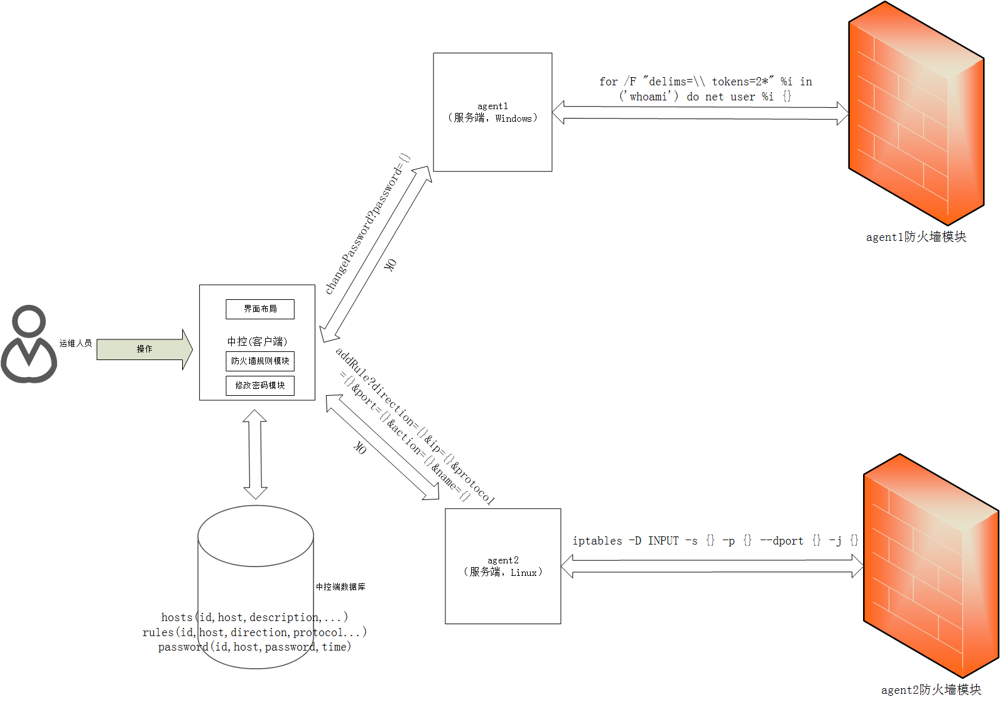

防火墙可视化配置工具典型经验
===============================

-------------------------
## 引言
防火墙可以给网络环境带来保护，但是由于windows（或linux）主机防火墙设置比较复杂，不直观，给运维人员带来了困难，设置效率过低。
本工具旨在通过对特定ip，端口，协议的可视化控制，简化防火墙的配置。

## 问题描述
* 不同操作系统的防火墙规则配置命令不一致
* 配置命令书写容易出错
* 不够方便查看已经配置过的规则

## 支持功能<br>
* 可视化显示，编辑防火墙规则
* 根据ip，端口，协议控制防火墙规则，包括添加，删除，编辑
* 支持网段，端口范围的规则设计
* 防火墙规则在不同主机之间快速迁移

## 典型做法<br>
程序使用Python3开发，PyQt5作为GUI引擎
<br>
上图是该工具的设计思路。通过解析防火墙当前的规则，把规则结构化并保存在sqlite3数据库里；通过在工具界面编辑，修改数据库的内容，然后把数据库的规则push到防火墙上面去。工具自身会根据运行环境选择不同的命令。通过复制数据库文件可以实现防火墙规则在主机之间的快速迁移。

## 核心代码功能介绍
```python
def win_getFirewall(): #用于在windows环境下读取防火墙策略并按照特定格式返回
    ....
```
```python
def createDB(): #用于在初次使用或者没有数据库的时候创建数据库
    ....
```
```python
class MainForm(QDialog):
    ...
    def updateDB(self): #Pull from Firewall的按钮点击事件响应函数
        ...
    def updateFirewall(self): #Push to Firewall的按钮点击事件响应函数
        ...
    def addRule(self): #Add Rule的按钮点击事件响应函数
        ...
    def deleteRule(self): #Delete Rule的按钮点击事件响应函数
        ...
    ...
```
## 经验总结
### Push的时候主要使用的命令：<br>
Linux下面:<br>
```shell
iptables -F INPUT #清空INPUT规则链
```

```shell
iptables -A INPUT -s {ip} -p {protocol} --dport {port} -j {action} #逐条附加到INPUT规则链末尾
```

Windows下面:
```shell
netsh advfirewall firewall delete rule name=hhh #清空特定名字的规则链
``` 

```shell
netsh advfirewall firewall add rule name=hhh dir=in remoteip={ip} protocol={protocol} localport={port} action={action} name={name} #逐条附加到INPUT规则链末尾
```

### Pull的时候主要使用的命令：<br>
Linux下面：
```shell
iptables -L INPUT -n|awk -F ' ' 'BEGIN {count=-2;} {if(count>=0){action[count] = $1;protocol[count]=$2;ip[count]=$4;port[count]=$7;}count++;}; END{for (i = 0; i < NR; i++) print ip[i],port[i],protocol[i],action[i];}'
```

Windows下面：<br>
通过读取注册表里防火墙规则的注册表项，获取规则

### Delete的时候主要使用的命令：<br>
Linux下面：
```shell
iptables -D INPUT -s {ip} -p {protocol} --dport {port} -j {action}
```

Windows下面：
```shell
netsh advfirewall firewall delete rule remoteip={ip} localport={port} protocol={protocol} name={name}
```

## 使用手册<br>
### 运行环境:<br>
python3,PyQt5,Windows或者Linux（Windows7，Windows10，Ubuntu16.04已测试）
### 显示规则：<br>
点击Pull from Firewall会把防火墙的规则显示在表格里<br>
<br>
### 删除规则：<br>
选中其中一条规则，点击delete rule会删除选中的规则<br>
<br>
<br>

### 添加规则：<br>
点击Add Rule添加规则<br>
<br>
如果添加成功，id这一列会显示规则的id
<br>
添加成功后，点击Push to Firewall把规则从数据库同步到防火墙

## 注意事项：
* 每次添加/编辑规则完成后，点击Push to Firewall把规则从数据库同步到防火墙
* 删除规则后不需要点击Push to Firewall也会自动在firewall端删除
* 添加规则的时候，id这一项显示一个数字表示规则添加成功了
* 共享rules.db则可以在不同操作系统之间共享配置规则